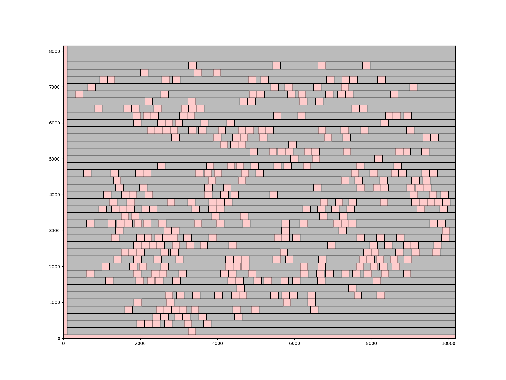
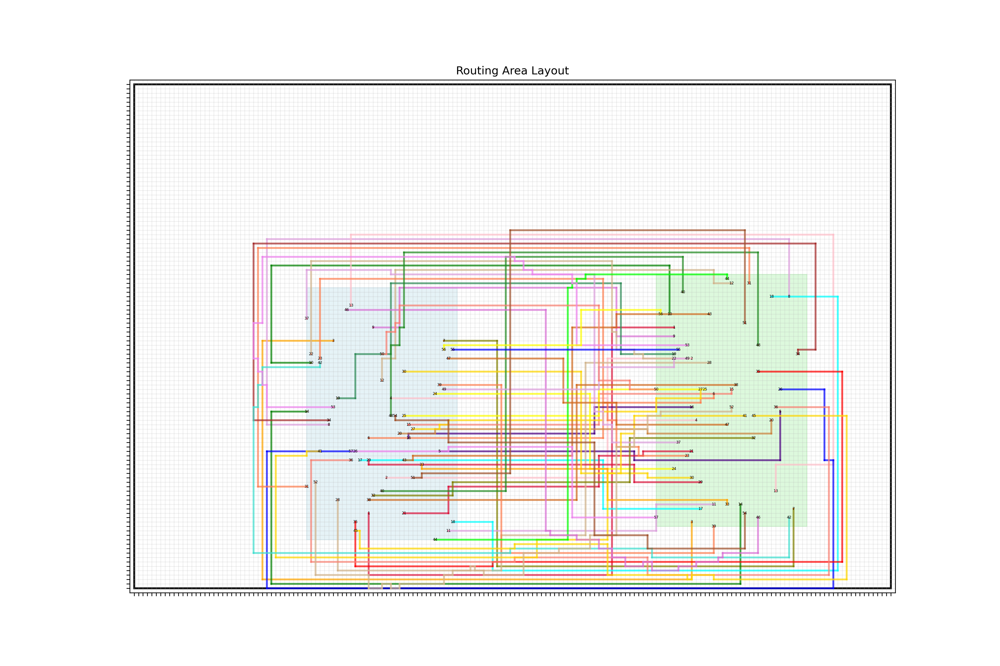

# NYCU-PDA-2024-FALL
## Lab1 - Corner Stitching

### Compile
- `$ make`
- Execute file: `Lab1`
### Run
- `./run <case_name>`
- `./Lab1 <input_case.txt> <output_case.txt> <layout_case.txt>`
- The `layout_case.txt` file is for plotting purpose
### Draw
- Make sure all required package installed (using anaconda, pip)
- `python draw_block_layout.py <layout_case.txt> <layout_case.png>`

## Lab2 - Floorplan with Simulated Annealing

### Compile
- `$ make`
- Execute file: `Lab2`
### Run
- `./run <case_name> <alpha>`
- `./Lab2 <alpha> <case.block> <case.nets> <output.txt>`
### Evaluator
- `./verifer <alpha> <case.block> <case.nets> <output.txt>`
### Draw
- `python draw_block_layout.py <output.txt> <output.png>`
- This only shows one frame, not a gif!

## Lab3 - Optimizer and Legalizer (Placement)

### Problem Spec & Evaluator
- https://hackmd.io/@coherent17/PDA_Lab3#NYCU-PDA-Lab3-Optimizer-and-Legalizer-Co-optimization
> [!WARNING]
> The performance of my current version is not good. I recommend reviewing others' work.
### Compile
- `$ make`
- Execute file: `Legalizer`
### Run
- `./run <1 2 3 4 5>`
- `./Legalizer <case.lg> <case.opt> <case_post.lg>`
### Draw
- `python draw.py -i <input.lg> -o <output.png>`
- Explore other flags inside `parse_arguments` function

## Lab4 - A* Search Routing

### Problem Spec & Evaluator
- https://hackmd.io/@krmb/PDA_Lab4#IEE-PDA_Lab4-Die-to-Die-Global-Routing
### Compile
- `$ make -j`
- Execute file: `D2DGRter`
### Run
- `./run <path_to_case> <case_name>`
- `./D2DGRter <case.gmp> <case.gcl> <case.cst> <output.lg>`
### Draw
- `python draw.py <path_to_case>`